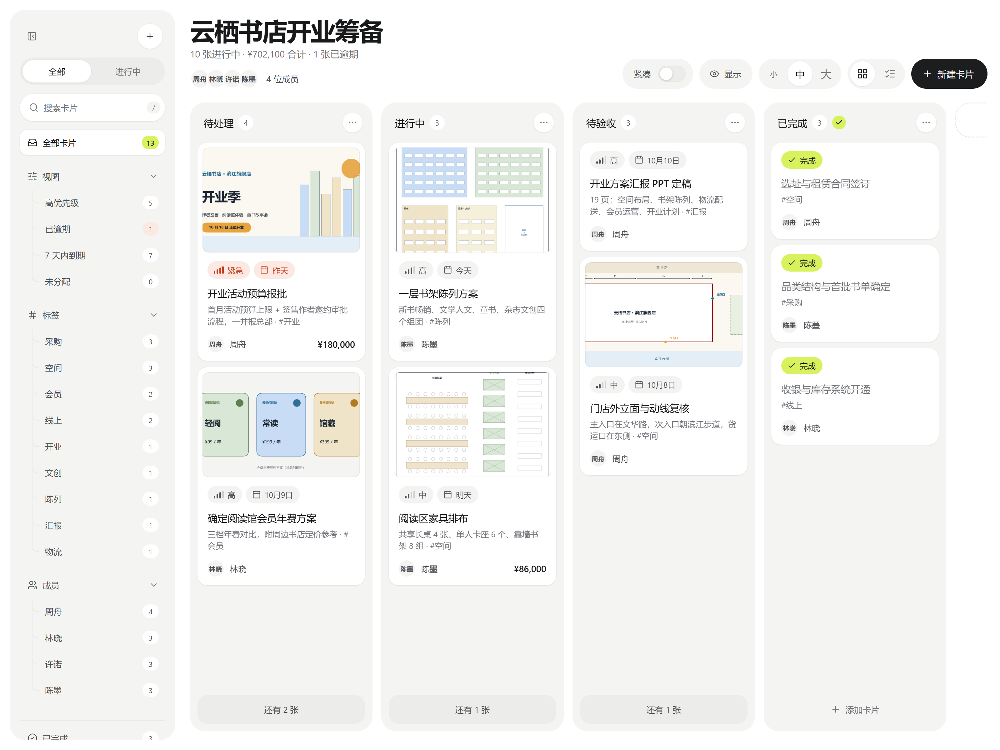
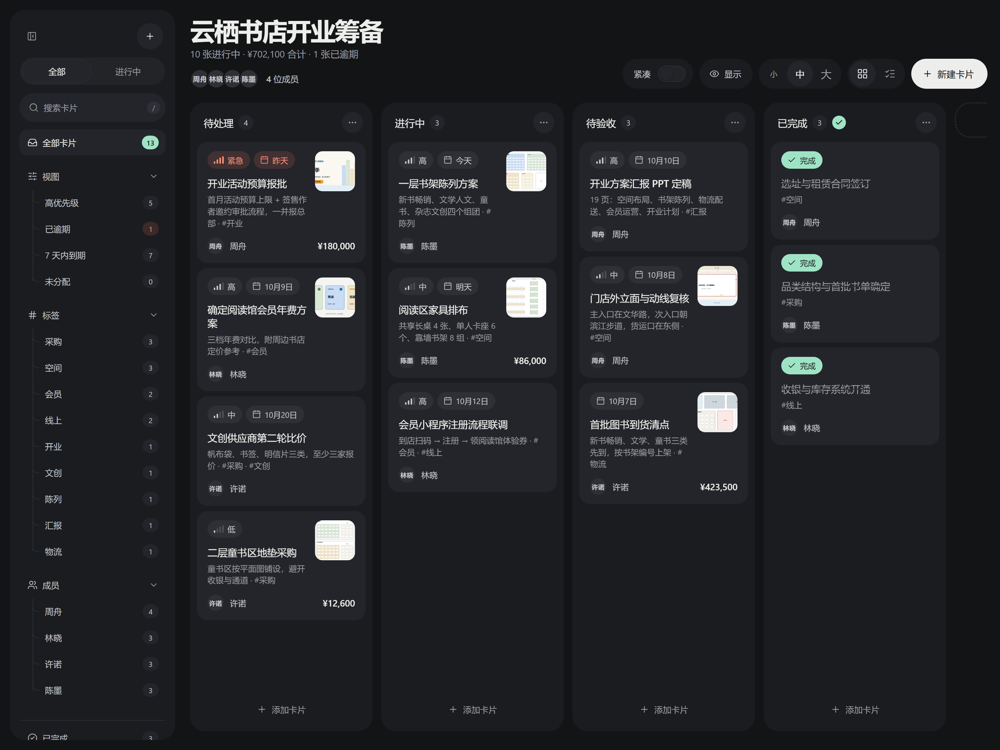
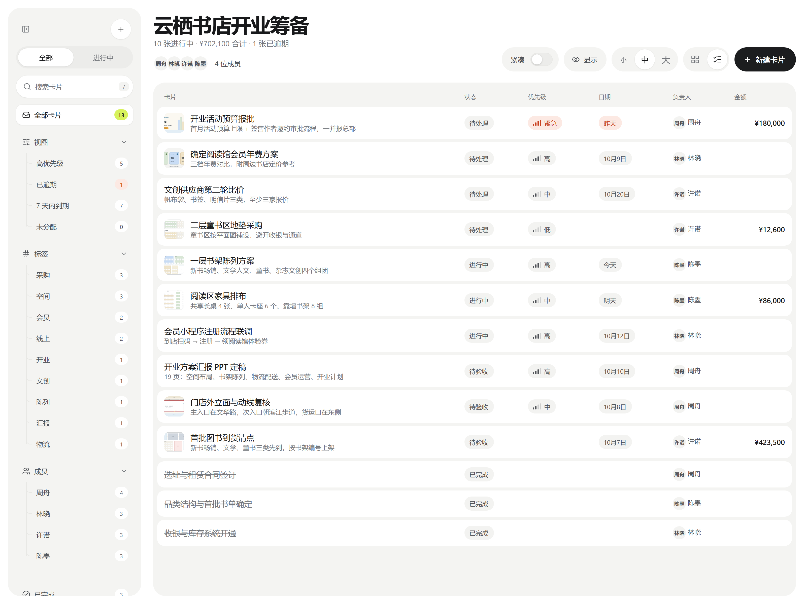
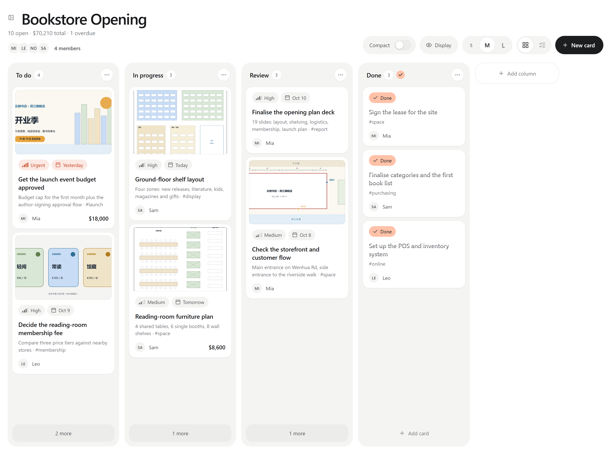

# Kanban Studio

> **English** — A clean, modern kanban board for Obsidian. Your board is a plain Markdown file: each `##` heading is a column and each `- [ ]` task is a card. Cards support priority, due date, assignee, amount, tags, description and images. Drag cards between columns, filter by view / tag / member, switch between board and list view, and pick an accent color. The interface is available in English and Chinese (follows Obsidian's language by default). Uninstalling the plugin never loses data — it's still just Markdown.

一个更干净、更现代的 Obsidian 看板插件。数据就是普通 Markdown：一个 `##` 是一列，一个 `- [ ]` 是一张卡片，卸载插件也不会丢任何内容。界面支持中文和英文（默认跟随 Obsidian）。



| 深色模式 · 右侧缩略图 | 列表视图 | English UI |
|---|---|---|
|  |  |  |

截图里的看板就是 [`examples/云栖书店-旗舰店开业筹备.md`](examples/云栖书店-旗舰店开业筹备.md)（虚构项目），连同 `examples/云栖书店-附件/` 一起放进库里就能打开。

## 安装

**从社区插件安装（上架后）**：Obsidian → 设置 → 第三方插件 → 浏览，搜索 **Kanban Studio**，安装并启用。

**手动安装**：从 [Releases](../../releases) 下载最新版本的 `main.js`、`manifest.json`、`styles.css`，放进 `<库>/.obsidian/plugins/studio-kanban/`，然后在 设置 → 第三方插件 里启用 **Kanban Studio**。

想先看效果，可以把 `examples/` 里的示例看板放进库里打开。

## 用法

- 左侧功能区图标 / 命令面板「新建看板」创建看板；文件夹右键菜单也可以新建
- 带有 `studio-kanban: board` 属性的笔记会自动以看板打开
- 右上角文档图标、侧栏「Markdown 源文件」或命令「在看板与 Markdown 之间切换」查看源文件
- **看板标题点一下就能改**：回车或点别处保存，Esc 取消。frontmatter 里有 `title:` 就改它，否则重命名文件
- 拖动卡片换列、排序；点击卡片编辑；右键卡片快速移动 / 完成 / 删除
- 列标题的「…」菜单：重命名、左右移动、设为完成列、删除
- 左侧导航栏可隐藏：点侧栏顶部的收起按钮（隐藏后看板标题左边会出现展开按钮）、命令「显示 / 隐藏看板侧栏」（可绑快捷键），或在插件设置里关掉；状态会记住
- 侧栏可按 视图（高优先级 / 已逾期 / 7 天内到期 / 未分配）、标签、成员筛选；最下面的「设置」直接打开本插件设置页
- 「紧凑」开关和 看板 / 列表 两种视图
- 右上角「显示」按钮 / 插件设置：自由选择卡片上显示哪些信息（优先级、日期、负责人、金额、描述、标签、图片），以及顶部统计、成员头像、侧栏分组。只是隐藏，数据不会丢
- 图片：编辑卡片时拖入、粘贴或从库中选择；也可以把图片文件直接拖到看板上的卡片。第一张作为封面，点图片可放大浏览（← → 切换）
- 图片显示方式可选「顶部大图 / 右侧缩略图」，封面高度「矮 / 中 / 高」，填充「裁剪填满 / 完整显示」（图纸、截图建议完整显示）
- 字体大小 小 / 中 / 大 三档：看板右上角直接切换，或在插件设置里选（全局生效、会记住）
- 分段按钮（全部 / 进行中、小 / 中 / 大、看板 / 列表）可以点，也可以按住左右拖
- 界面语言：插件设置 →「界面语言」，可选 跟随 Obsidian / 中文 / English

### 鼠标左右滚动
- 带拇指滚轮 / 左右滚轮的鼠标可以直接左右滚动看板；也可以按住 Shift 再滚滚轮。
- **罗技 MX Master 系列 + Logi Options+**：如果左右滚动时灵时不灵，在 Options+ 里给 Obsidian 添加应用专属设置，把**拇指滚轮的「平滑滚动」关掉**。平滑模式下 Options+ 模拟出来的横向滚动，Obsidian 有时收不到方向。
- 还有问题的话，可以运行命令「开始 / 停止记录鼠标滚动（排查用）」，日志在插件目录的 `wheel-log.txt`。

## Markdown 格式

```markdown
---
studio-kanban: board
title: 看板标题（可选，默认用文件名）
---

## 列名

- [ ] 卡片标题 !high @2026-10-05 ~张伟 ¥1280 #土建
	这一行是描述，第一行显示为副标题
```

| 标记 | 含义 |
|---|---|
| `!critical` `!high` `!medium` `!low`（或 `!紧急` `!高` `!中` `!低`） | 优先级 |
| `@2026-10-05` 或 `📅 2026-10-05` | 日期（过期自动标红） |
| `~张伟` / `~"Nate Coleman"` | 负责人 |
| `¥1280` `$310` `€90` | 金额（顶部合计） |
| `#标签` | 标签 |
| `- [x]` | 已完成 |
| 描述里单独一行 `![[照片.jpg]]` 或 `` | 卡片图片（第一张为封面） |

新上传的图片按 Obsidian「设置 → 文件与链接 → 附件默认存放路径」保存。

## 调整配色

`styles.css` 最上面 `.sk-root { … }` 是浅色变量，`.theme-dark .sk-root { … }` 是深色变量。强调色在插件设置里有 10 个预设（青柠、薄荷、天空、薰衣草、蜜桃、琥珀、珊瑚、靛蓝、森林、石墨），也可以自定义任意颜色；强调色上的文字会按深浅自动切成黑字或白字。

三档字号的倍率在 `.sk-size-s / -m / -l` 里（默认 0.9 / 1 / 1.14）。

## 开发

```bash
npm install
npm run dev      # 监听 src/ 自动构建
npm run build    # 类型检查 + 生成 main.js
npm test         # vitest 单元测试
npm run lint     # Obsidian 社区插件审核规则（eslint-plugin-obsidianmd）
```

```
studio-kanban/
├── src/                 ← TypeScript 源码（结构见 docs/IMPLEMENTATION.md §1）
├── styles.css           ← 样式
├── manifest.json        ← 插件信息
├── tests/               ← vitest 测试
├── docs/
│   ├── DESIGN.md        ← 设计规范：颜色、字号、组件、动效、设置项
│   └── IMPLEMENTATION.md← 实现说明：代码结构、文件格式、验证状态、已知问题
├── examples/             ← 示例看板（云栖书店，虚构）和配图
└── CHANGELOG.md
```

## 许可

[MIT](LICENSE)
